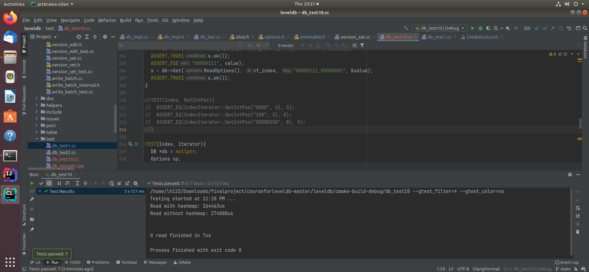

# README
##测试中的一些小错误
iter_->key().ToString()获得的是该数据的value
由于索引的存储格式，我们索引中存储的iter_->value()为空值，我们只能解析它的key值来获取
##因为我的IndexIterator写在db_iter.cc内所以无法用
IndexIterator::GetIntPos，所以我就把关于它的测试注释掉了
##结果 

最后可以通过除了关于IndexIterator的七个测试，且使用hashmap的效率要远大于不使用hashmap的效率！ 

